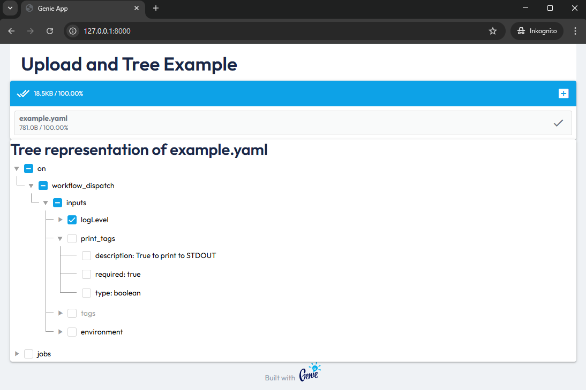

# GenieAppUploadAndTree.jl



This repository contains an example web app using [GenieFramework](https://genieframework.com/).

The app combines the `uploader(...)` component and the `tree(...)` component with corresponding reactivity.

The app allows uploading YAML and JSON files. The files are parsed using [YAML.jl](https://github.com/JuliaData/YAML.jl) and displayed as tree.

The purpose of the app is to provide a working example of some sparsely documented GenieFramework features.

## How to run the app?

Clone the repository and navigate to the repo folder.

```
git clone https://github.com/sschlenkrich/GenieAppUploadAndTree.jl
```

Load the app and start the server.

```
julia --project=. -e "using GenieFramework; Genie.loadapp(); up(async=false);"
```

This should produce the following output.

```
 ██████╗ ███████╗███╗   ██╗██╗███████╗    ███████╗
██╔════╝ ██╔════╝████╗  ██║██║██╔════╝    ██╔════╝
██║  ███╗█████╗  ██╔██╗ ██║██║█████╗      ███████╗
██║   ██║██╔══╝  ██║╚██╗██║██║██╔══╝      ╚════██║
╚██████╔╝███████╗██║ ╚████║██║███████╗    ███████║
 ╚═════╝ ╚══════╝╚═╝  ╚═══╝╚═╝╚══════╝    ╚══════╝

| Website  https://genieframework.com
| GitHub   https://github.com/genieframework
| Docs     https://learn.genieframework.com
| Discord  https://discord.com/invite/9zyZbD6J7H
| Twitter  https://twitter.com/essenciary

Active env: DEV


Ready! 


[ Info: Web Server starting at http://127.0.0.1:8000 - press Ctrl/Cmd+C to stop the server. 
[ Info: Listening on: 127.0.0.1:8000, thread id: 1
```

Access the app via [http://127.0.0.1:8000](http://127.0.0.1:8000).
